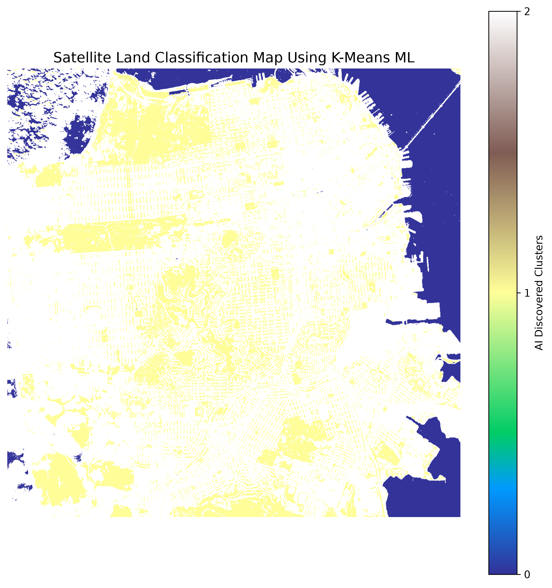

# Satellite Land Classification Using Unsupervised Machine Learning

This project streams live multi-spectral satellite imagery from the cloud, calculates environmental vegetation indexes, and uses machine learning to classify terrain types.

## Engineered Feature Map vs. AI Classification
Here are the outputs generated by the pipeline:

### 1. Continuous NDVI Feature Matrix
This map displays the raw vegetation health calculations across coordinates.

### 2. K-Means ML Classified Terrain
This map displays the boundaries discovered completely by the unsupervised clustering model.

## How It Works
1. Queries AWS STAC Catalog for low-cloud Sentinel-2 imagery.
2. Streams Red and NIR bands using Rasterio windowing.
3. Computes Normalized Difference Vegetation Index (NDVI).
4. Clusters pixel values into 3 distinct land covers using Scikit-Learn's K-Means.
